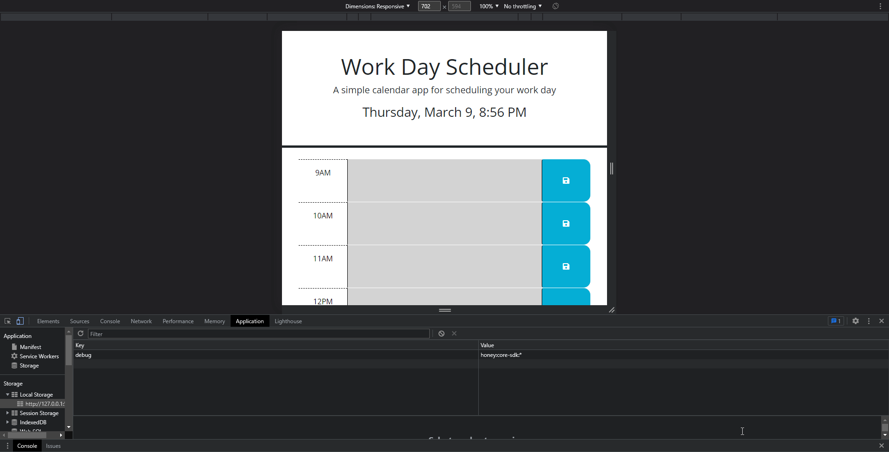

# 3rd-party-API Day Schedular

## Description

A work day schedular that users can plan out the current day  upcoming work day schedule. Their work day schedule persist even when they close and reopen the webpage.

 

## Table of Contents
- [Installation](#installation-installation)
- [Usage](#usage-usage)
- [License](#license-license)
- [Contributing](#contributing-contributing)
- [Tests](#tests-tests)
- [Questions](#questions-questions)
        
## Installation {#installation}
        
To install Clone down repository, and open index.html in live server to access application.

## Usage {#usage}
        
To use web application, Provide description for wanted time block and click save; to save description to local storage.
        
## License {#license}
        
None
     
## Contributing {#contributing}
        
Please No contributions to this repository.
        
## Tests {#tests}

Used Live Server to Test        

 
## Questions {#questions}
If you have any questions, please feel free to contact me at alex.horning.54@gmail.com 
or check out my GitHub profile at [Makeitouthill](https://github.com/Makeitouthill).